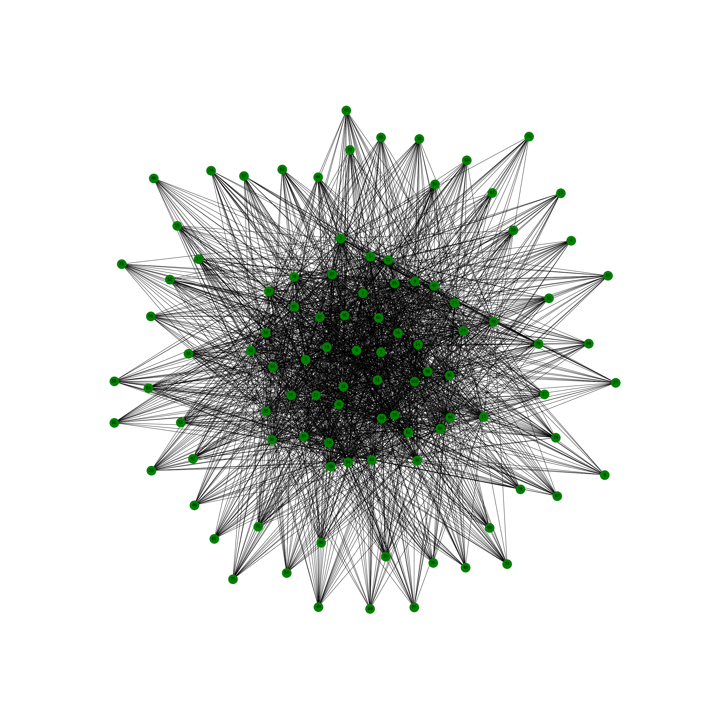
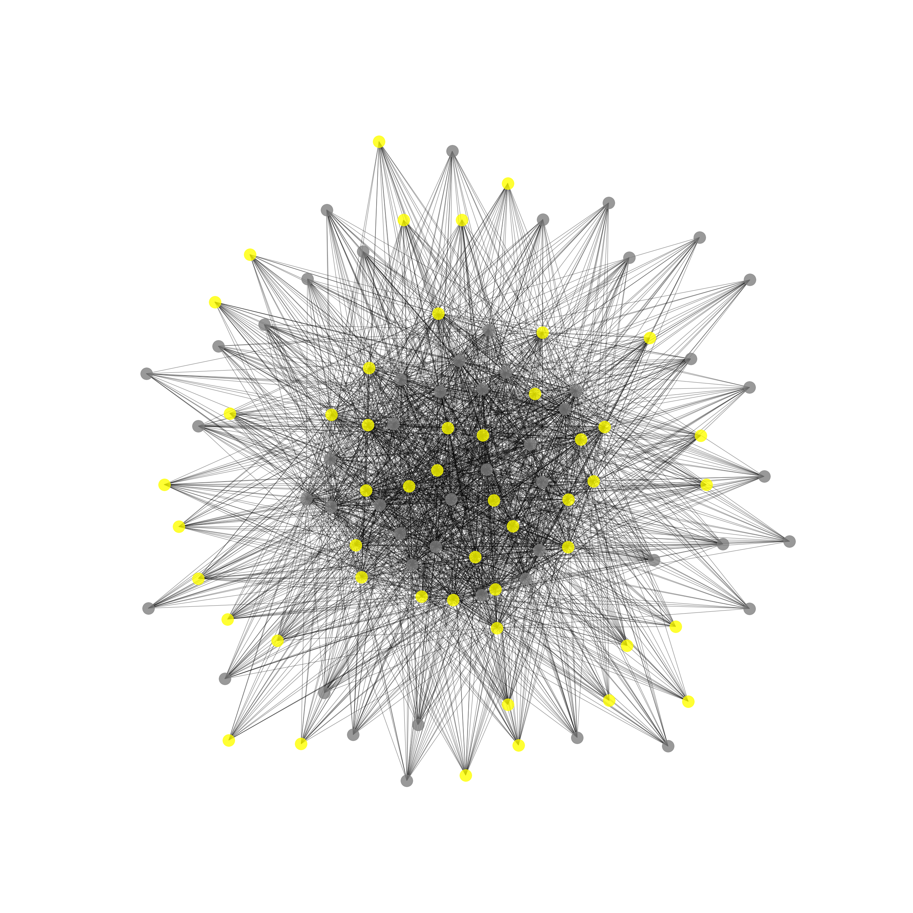

Designing a system for simulating the spread of infectious diseases based on network science.
* Node status: susceptible (0: green), exposed (1: yellow), infectious (2: red), and recovered (3: gray) individuals.
* Install these packages using python3 
```
pip3 install numpy
pip3 install python-dotenv
pip3 install networkx
pip3 install matplotlib

``` 
* To start simulating run start.py
* Config simulating parameters in .env file.

* Before diseases infection



* After diseases infection

